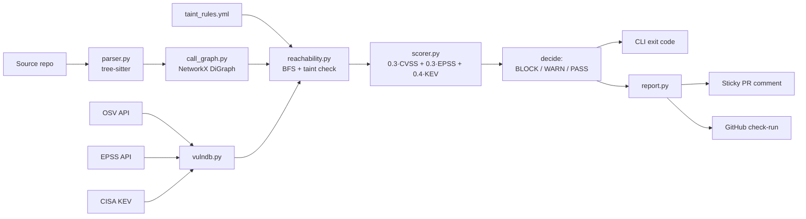
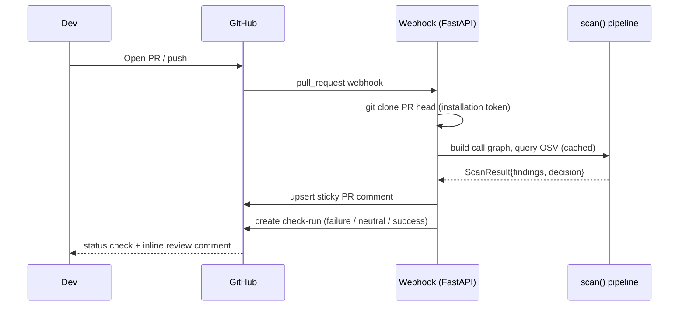

# reachable-cve

[](https://github.com/adi-bmsce/reachable-cve/actions/workflows/ci.yml)
[](https://github.com/adi-bmsce/reachable-cve/actions/workflows/security.yml)
[](https://pypi.org/project/reachable-cve/)
[](https://pypi.org/project/reachable-cve/)
[](LICENSE)

Reachability-aware vulnerability scanner. Cuts Snyk/Dependabot noise by ~80% by combining three signals into one **real-exploitability score**:

```
score = 0.3 · CVSS  +  0.3 · EPSS  +  0.4 · KEV   (× 0.1 if unreachable)
```

* **Static call-graph reachability** — does *your* code actually call the vulnerable function?
* **EPSS** — FIRST.org's probability the CVE will be exploited in the next 30 days.
* **CISA KEV** — is it on the catalog of actively-exploited vulns?

Ships as a CLI and a FastAPI-based GitHub App that posts a diff on every PR.

---

## How it works



### CI/CD integration



### Pipeline trace (text version)

```
 repo  ─►  tree-sitter ─►  ParsedModule ─►  NetworkX call graph
                                                │
 OSV (cached 1h)  ─►  VulnRecord(symbols=["yaml.load"])  ▼
 EPSS (cached 24h) ─►  + epss               BFS from entrypoints +
 KEV (cached 24h)  ─►  + kev_bit            taint kwarg check
                                                │
                                                ▼
                                       Finding(score, severity)
                                                │
                                                ▼
                                CLI / Markdown PR comment / check-run
```

**Resolution.** Imports build an alias table (`import yaml as y` → `y` resolves to `ext:yaml`). Calls are tagged with file/line. Local defs become graph nodes; external calls become `ext:<dotted.path>` terminals. Reachability is plain BFS over the directed graph.

**Vulnerable symbols.** OSV doesn't tell us *which function* in a package is vulnerable, so `vulndb.SYMBOL_MAP_DEFAULT` ships curated sinks for the top high-impact CVEs (PyYAML, Mako, Jinja2, requests, urllib3, Pillow…). Override per-repo with `.reachable-cve.yml`.

---

## Run it

### 1. Install

```bash
cd reachable-cve
python -m venv .venv
source .venv/bin/activate          # Windows: .venv\Scripts\activate
pip install -e .
```

### 2. Scan the bundled demo

The demo repo (`examples/demo_repo`) pins three vulnerable packages but only *calls* `yaml.load`. You should see PyYAML come back **reachable** while `requests` and `jinja2` come back **unreachable**.

```bash
reachable-cve scan examples/demo_repo
```

Output formats:

```bash
reachable-cve scan examples/demo_repo --format markdown    # for PR comments
reachable-cve scan examples/demo_repo --format json        # for CI gates
```

CI gating:

```bash
reachable-cve scan . --fail-on reachable    # default: fail only on reachable
reachable-cve scan . --fail-on any          # strict: fail on anything
```

Debug the call graph:

```bash
reachable-cve graph examples/demo_repo
```

### 3. Run the tests

```bash
pytest -q
```

The smoke tests don't hit the network — they exercise parsing, call-graph construction, BFS, and the scorer against the demo repo.

### 4. Run the GitHub App locally

```bash
cp .env.example .env                       # fill in app id, key path, webhook secret
uvicorn reachable_cve.server:app --reload --port 8080
```

Expose with [smee.io](https://smee.io/) or `ngrok http 8080`, point your GitHub App's webhook URL there, install the app on a repo, open a PR. The bot clones the head commit, runs `scan()`, and upserts a sticky PR comment.

### 5. (Optional) Wire it into a `pre-commit` hook

```yaml
# .pre-commit-config.yaml
- repo: local
  hooks:
    - id: reachable-cve
      name: reachable-cve
      entry: reachable-cve scan . --fail-on reachable
      language: system
      pass_filenames: false
```

---

## Configuration: `.reachable-cve.yml`

Drop this at the root of the scanned repo to extend the sink map:

```yaml
symbol_map:
  cryptography:
    - cryptography.hazmat.primitives.ciphers.Cipher
  lxml:
    - lxml.etree.parse
    - lxml.etree.fromstring
```

---

## Project layout

```
reachable-cve/
├── pyproject.toml
├── src/reachable_cve/
│   ├── parser.py          # tree-sitter → ParsedModule
│   ├── call_graph.py      # alias resolution + NetworkX DiGraph
│   ├── vulndb.py          # OSV + EPSS + KEV + symbol map
│   ├── reachability.py    # BFS entrypoints → vuln symbols
│   ├── scorer.py          # CVSS+EPSS+KEV → 0-100 + severity label
│   ├── engine.py          # scan() orchestrator
│   ├── report.py          # terminal + markdown rendering
│   ├── cli.py             # `reachable-cve` command
│   ├── github_bot.py      # PR comment upsert
│   └── server.py          # FastAPI webhook
├── examples/demo_repo/    # one reachable + two unreachable CVEs
└── tests/test_smoke.py
```

---

## CI gate: BLOCK / WARN / PASS

`reachable-cve scan` exits with a code derived from a deterministic policy:

| Verdict | Exit | Triggers |
|---------|-----:|----------|
| `BLOCK` | 2 | At least one **reachable** finding with `score ≥ block_score` (default 60). |
| `WARN`  | 1 | At least one reachable finding below the block threshold. |
| `PASS`  | 0 | No reachable findings. Unreachable items — even KEV-critical ones — are informational. |

The strict-reachability rule is intentional. The pitch of this tool is "70-90% of critical alerts are unreachable; alert fatigue kills security programs." If unreachable items triggered WARN, we'd just have moved the noise from CRITICAL to WARN.

```bash
# Default — gate on the decision policy
reachable-cve scan . --policy decision

# Tune thresholds
reachable-cve scan . --block-score 70 --warn-score 40

# Legacy: fail on any reachable, regardless of score
reachable-cve scan . --policy reachable

# Human-readable attack paths
reachable-cve scan . --explain
```

The same verdict drives the GitHub check-run conclusion: BLOCK → `failure` (red),
WARN → `neutral` (yellow), PASS → `success` (green). The PR comment is sticky
via the marker `<!-- reachable-cve:bot -->` — subsequent webhook calls `edit()`
the same comment instead of stacking new ones.

### Example PR comments

**BLOCK** — reachable yaml.load, in KEV:

> :no_entry: **BLOCK** — 1 reachable finding(s) at score >= 60.0 (top: GHSA-… @ 96.7)
>
> **1 critical** reachable · 2 unreachable
>
> #### `CVE-2020-14343` — Score **96.7** (critical)
> - Package: `pyyaml==5.3.1`
> - CVSS: **9.8** · EPSS: **0.823** · KEV: **yes**
> - Sink: `yaml.load`
> - **Remediation:** upgrade pyyaml to >= 5.4

**WARN** — reachable but below the block threshold:

> :warning: **WARN** — 1 reachable finding(s) below block threshold
>
> A medium-severity reachable CVE: score 42, no remediation gate triggered, surface for review.

**PASS** — vulnerable dep present, never called:

> :white_check_mark: **PASS** — no reachable findings
>
> 3 unreachable (informational)

## Hardening notes

### Known false-positive scenarios

| Scenario | Example | Why we still flag | Mitigation |
|---|---|---|---|
| **Over-broad sink map** | `requests.get` flagged for CVE-2023-32681 (proxy-auth-leak) even when no proxy is configured | We are not yet *argument-sensitive* — any call counts | Per-repo override in `.reachable-cve.yml` until dataflow lands |
| **Re-exports look external** | `from app.helpers import safe_load_config` then `safe_load_config()` | `_resolve_callee` resolves the import to `ext:app.helpers.safe_load_config` because it treats every import as external | Tracked — fix is to consult `local_funcs` after applying aliases |
| **Unmapped packages** | A package not in `SYMBOL_MAP_DEFAULT` falls back to "any import of the package" | Conservative by design; better to over-flag than miss | Add to `SYMBOL_MAP_DEFAULT` or `.reachable-cve.yml` |

### Known false-negative scenarios

| Scenario | Example | Why we miss it | Mitigation |
|---|---|---|---|
| `self.method()` calls | `self._loader(data)` inside a class | Resolver returns `[]` for `self.*` to avoid wild over-approximation | Track class context; resolve via `__init__` assignments. Planned. |
| Dynamic dispatch | `getattr(yaml, "load")(...)` | Textual matcher cannot see the string | Pattern rules for `getattr` + constant string — planned. |
| Decorator wrapping | `@safe_yaml def load(x): return yaml.load(x)` | The decorator may wrap the callable but we don't track the wrapped target | Heuristic: treat decorated functions as reachable equivalent of body |
| Conditional imports | `if DEBUG: import yaml` | We treat all imports as live | Acceptable — under-counting unreachable is a worse failure mode |
| Implicit entrypoints | Flask route handlers, Django views, pytest tests | Heuristic entry set is small | Add framework adapters (Flask `@app.route`, Django `urls.py`, pytest discovery) |

### Architectural weaknesses worth tracking

1. **No cache for OSV/EPSS/KEV responses.** Every scan re-fetches. For large monorepos this is wasteful. Add `~/.cache/reachable-cve/{osv,epss,kev}.json` with a TTL.
2. **Webhook clones over HTTPS without the installation token** in `server.py`. Works for public PRs only. Private repos need `gh.get_app_installation_token()`.
3. **No structured logging or telemetry.** Add `logging` with JSON formatter; emit a per-finding event so users can hook Splunk / Loki.
4. **EPSS calls aren't rate-limited.** First.org currently allows ~1000/req/day, but we should respect their advisory headers.
5. **The CVSS extractor depends on the `cvss` package**, which has occasional spec drift. We pin `>=3.0` and fall back to severity-label mapping if parsing fails.
6. **Reachability matcher is name-based**, not type-based: `yaml.load` matches both the stdlib alias and the PyYAML function. Acceptable today; revisit if it produces noise.

### Tested invariants (see `tests/`)

- `_extract_cvss` returns the right score for GHSA-numeric, vector-only, label-only, and absent advisories (`test_cvss_extraction.py`)
- `apply_threat_intel` flips `in_kev` for CVEs in the KEV set; `score_finding` adds exactly 40 points when KEV=true and the finding is reachable (`test_kev_matching.py`)
- Replacing `yaml.load` with `yaml.safe_load` flips `reachable=True` to `reachable=False` while leaving the safe call visible in the graph (`test_reachability_flip.py`)
- Markdown report contains the decision badge, severity summary, remediation hint, and attack-path code block (`test_reporting.py`)
- `decide()` returns `BLOCK` / `WARN` / `PASS` with the documented thresholds and exit codes (`test_decision.py`)

Run the full suite:

```bash
pip install -e .[dev]
pytest -q
```

## Running with Docker

```bash
cp .env.example .env       # fill in GITHUB_APP_ID, GITHUB_WEBHOOK_SECRET
# place private-key.pem next to docker-compose.yml
docker compose up -d --build
curl localhost:8080/healthz   # -> {"ok": true}
```

The compose stack runs the webhook on `:8080`, persists the OSV/EPSS/KEV cache in a named volume, exposes a `/healthz` probe, and runs as a non-root user with `tini` for signal handling. JSON logs go to stderr — pipe them straight into Loki, Splunk, or CloudWatch.

## Structured logging

Every operational event is one JSON line on stderr:

```json
{"ts":"2026-06-23T11:42:08.123Z","level":"INFO","event":"finding","osv_id":"GHSA-...","reachable":true,"score":94.1,"decision":"BLOCK","cvss":9.8,"epss":0.823,"in_kev":true}
{"ts":"2026-06-23T11:42:08.150Z","level":"INFO","event":"scan_done","decision":"BLOCK","n_findings":3,"n_reachable":1}
{"ts":"2026-06-23T11:42:09.012Z","level":"INFO","event":"osv_query","package":"pyyaml","cache":"miss"}
```

Stable event names: `finding`, `scan_done`, `osv_query`, `epss_query`, `kev_query`, `osv_error`. Filter on these in your log pipeline.

To disable JSON formatting locally:

```bash
reachable-cve --log-text scan .
```

## Benchmarks

`benchmarks/run.py` compares scanner output to hand-labeled ground truth and prints precision/recall/F1. Add new targets in `benchmarks/labels.yml`.

```bash
python benchmarks/run.py                  # text
python benchmarks/run.py --output md      # GitHub-friendly markdown
python benchmarks/run.py --target pygoat  # single target
```

Expected output on the bundled targets:

```
demo_vulnerable      P=1.000 R=1.000 F1=1.000  (1TP 0FP 2TN 0FN) decision=BLOCK
clean_baseline       P=0.000 R=0.000 F1=0.000  (0TP 0FP 0TN 0FN) decision=PASS
```

Add PyGoat:

```bash
git clone https://github.com/adeyosemanputra/pygoat benchmarks/_external/pygoat
python benchmarks/run.py --target pygoat
```

See `benchmarks/README.md` for the labeling workflow.

## End-to-end usage for a different user

If you're a developer landing on this repo for the first time, here is the full path from zero to "the bot is gating my PRs."

### Option A: I just want to scan my repo locally

```bash
pip install reachable-cve
cd /path/to/your/python/project
reachable-cve scan . --explain
```

You get a colorized table of findings, an attack-path narrative for each reachable one, and an exit code: `0` (PASS), `1` (WARN), `2` (BLOCK). Wire that into any CI:

```bash
reachable-cve scan . --policy decision
```

### Option B: I want a sticky PR comment + check-run on GitHub

Two ways. Pick one.

**B1: GitHub Actions workflow (zero infrastructure).** Copy `.github/workflows/security.yml` from this repo into yours. It runs on every PR, uploads the JSON report as an artifact, posts a sticky markdown comment via `gh pr comment`, and fails the workflow when the decision is BLOCK. Required permissions are declared in the workflow file.

**B2: Self-hosted GitHub App (best for organizations).**

1. Create a GitHub App at `https://github.com/settings/apps/new`. Permissions: `Contents: Read`, `Pull requests: Write`, `Checks: Write`. Subscribe to: `Pull request`. Generate a private key.
2. Deploy the webhook:
   ```bash
   git clone https://github.com/adi-bmsce/reachable-cve
   cd reachable-cve
   cp .env.example .env
   # edit .env: GITHUB_APP_ID, GITHUB_WEBHOOK_SECRET
   # put downloaded private-key.pem next to docker-compose.yml
   docker compose up -d --build
   ```
3. Point the App's webhook URL at your server (`https://your.host/webhook`). Use [smee.io](https://smee.io) for local testing.
4. Install the App on your repo. Open a PR — within seconds you'll see a sticky comment and a check-run.

### Option C: I just want to try it on the demo

```bash
git clone https://github.com/adi-bmsce/reachable-cve
cd reachable-cve
pip install -e .[dev]
reachable-cve scan examples/demo_repo --explain
```

Expected: PyYAML CVE-2020-14343 flagged **BLOCK** (reachable via `yaml.load`); requests and jinja2 CVEs marked **informational** (unreachable). Exit code: `2`.

### Configuration

| File | Purpose |
|---|---|
| `.reachable-cve.yml` | Per-repo overrides for the vulnerable-symbol map |
| `.env` | GitHub App secrets, log level, cache dir |
| `~/.cache/reachable-cve/` | OSV/EPSS/KEV cache (auto-managed; safe to delete) |
| `taint_rules.yml` (in package) | Argument-aware sink rules (kwarg presence) |

### CLI reference

```bash
reachable-cve scan <path>                # scan a directory
  --format text|markdown|json            # output format
  --policy decision|any|reachable|never  # CI exit-code policy
  --block-score 60.0                     # BLOCK threshold
  --warn-score 30.0                      # WARN threshold
  --explain                              # print attack-path narratives

reachable-cve graph <path>               # dump the call graph (debug)

# global options
  --log-json / --log-text                # structured (default) or plain logs
  --log-level INFO                       # DEBUG / INFO / WARNING / ERROR
```

### Environment variables

| Var | Default | Purpose |
|---|---|---|
| `REACHABLE_CVE_CACHE_DIR` | `~/.cache/reachable-cve` | Cache location |
| `REACHABLE_CVE_KEV_FIXTURE` | unset | Path to a local KEV JSON (for testing / air-gapped) |
| `OSV_API` | `https://api.osv.dev/v1` | OSV endpoint override |
| `EPSS_API` | `https://api.first.org/data/v1/epss` | EPSS endpoint override |
| `KEV_URL` | CISA URL | KEV catalog URL |
| `RCVE_LOG_LEVEL` | `INFO` | Logging verbosity |
| `RCVE_LOG_JSON` | `1` | `0` for plain-text logs |
| `GITHUB_APP_ID` | — | (webhook) App identifier |
| `GITHUB_WEBHOOK_SECRET` | — | (webhook) HMAC-SHA256 secret |
| `GITHUB_APP_PRIVATE_KEY_PATH` | `./private-key.pem` | (webhook) PEM key path |

### PyPI publication (maintainer commands)

```bash
pip install build twine
python -m build              # produces dist/*.whl and dist/*.tar.gz
twine check dist/*           # validates metadata
twine upload dist/*          # uploads to PyPI
```

## License

MIT.
