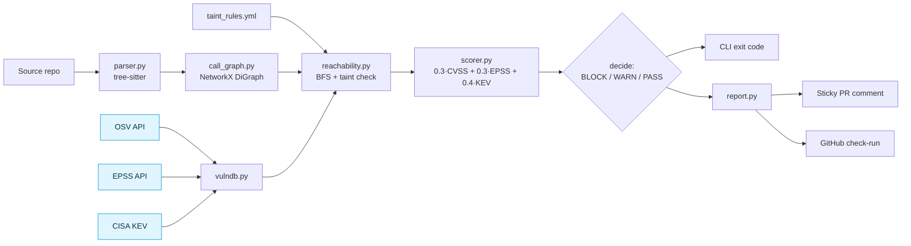
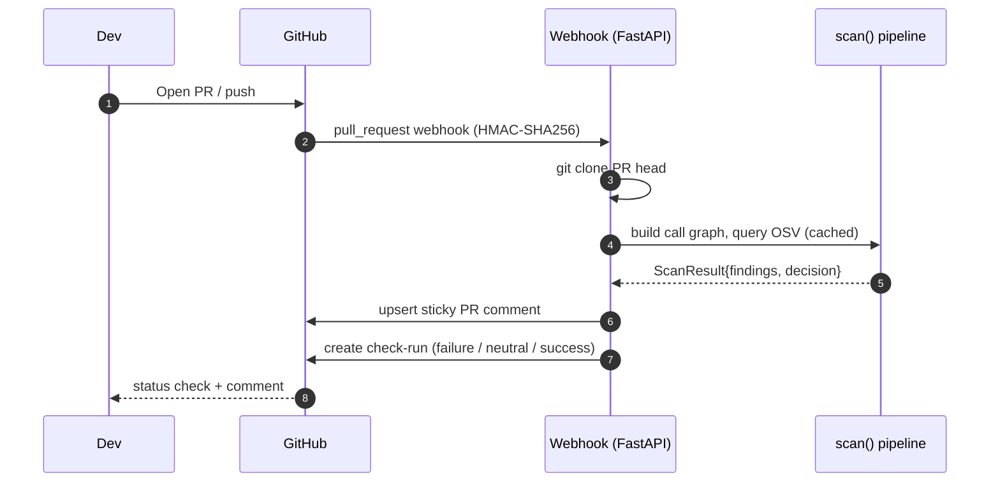

<div align="center">

# reachable-cve

**A reachability-aware vulnerability scanner for Python. Open-source MIT.**

Static call-graph reachability · EPSS · CISA KEV · argument-aware sinks.
Ships as a CLI, a GitHub Actions workflow, and a self-hosted GitHub App.

[](tests/)
[](pyproject.toml)
[](Dockerfile)
[](LICENSE)

</div>

> **Status: v0.2.0 — working prototype with production-ready scaffolding.** CI passes, tests pass, Docker builds, all integrations wire up. The bundled benchmark is synthetic and small. PyGoat / real-world labeling is not done yet. Numbers claimed in this README are limited to what the bundled tests and benchmark actually produce.

---

## Why reachability matters

Modern Python services pull in 100-200 transitive dependencies. Most generic SCA scanners (Dependabot, pip-audit, free-tier Snyk) flag every CVE in those dependencies regardless of whether your code calls the vulnerable function. The result is alert fatigue: developers learn to swipe past the next critical alert, including the one that matters.

The hypothesis behind this project — backed by Endor Labs' 2023 *State of Dependency Management* report, which found ~71% of "critical" vulnerabilities in production codebases were unreachable in their study — is that **reachability is the right filter**. If your code can't reach the vulnerable symbol from any entrypoint, the CVE is informational, not actionable.

`reachable-cve` answers the reachability question for Python, combines it with two real-world threat-intel signals (EPSS and CISA KEV), and emits a single 0-100 score plus a CI verdict.

> Honest framing: the 71% figure is Endor's measurement on their dataset, not ours. We have not yet measured noise reduction on real-world repos — that's the v0.3 roadmap item.

## What this project actually does today

Capabilities present in the v0.2.0 codebase, verified by tests:

- **Tree-sitter Python parsing** — imports, functions (with decorators), call sites (with kwarg names), `self.X = ...` assignments inside `__init__`, and `getattr(mod, "const")` aliases.
- **Interprocedural call graph** — NetworkX `DiGraph` with class-aware `self.X` resolution, `<LocalClass>().method` instantiation chains, getattr synthetic edges, and re-export resolution.
- **OSV / EPSS / CISA KEV queries** with on-disk TTL cache (OSV 1h, EPSS 24h, KEV 24h).
- **5-tier CVSS extraction** — `database_specific.cvss.score` → severity label → CVSS v3 vector parse → v2 vector → label residual.
- **BFS reachability** from entrypoints (module top-level, `main`, `handler`, `lambda_handler`, `test_*`, framework decorators).
- **Framework decorator detection** for **Flask, FastAPI, Celery, AWS Lambda Powertools**. Django `urls.py` walker is *not* implemented (roadmap v0.3).
- **Argument-aware taint rules** — kwarg-*presence* matching (`requires_kwarg_present: [proxies]`). Kwarg-*value* matching needs dataflow and is *not* implemented.
- **Scoring** — `0.3·CVSS + 0.3·EPSS + 0.4·KEV`, multiplied by 0.1 if unreachable.
- **Decision engine** — BLOCK / WARN / PASS with tunable `--block-score` and `--warn-score`.
- **CLI** with text / markdown / JSON output, `--explain` for attack-path narratives, and `--policy` for exit-code semantics.
- **FastAPI webhook server** with HMAC-SHA256 signature verification, sticky PR comment upsert (HTML-marker based), and GitHub check-run publishing.
- **GitHub Actions workflows** — `ci.yml` (pytest matrix) and `security.yml` (scan + sticky comment + BLOCK gating).
- **Docker** — multi-stage build (slim runtime, non-root, tini, git for cloning, healthcheck).
- **Structured JSON logging** — one event per finding, scan, and API call; stable event names.
- **Benchmark framework** — `benchmarks/run.py` compares scanner output to hand-labeled ground truth and prints precision/recall/F1.
- **48 deterministic tests** passing locally (CVSS extraction, KEV matching, reachability flip, class resolution, getattr resolution, decorators, framework detection, taint rules, cache, logging, decision policy, reporting).

## What this project does NOT do (yet)

Stated upfront so reviewers don't have to find it:

- **No JavaScript / TypeScript / Go support.** Python only.
- **No full dataflow taint.** Kwarg presence is checkable; kwarg value is not. CVE-2023-32681 is suppressed when `proxies` is missing, but we can't confirm `proxies` was set to an attacker-controlled value.
- **No Django `urls.py` walker.** Flask/FastAPI/Celery/Lambda decorators work; Django view detection is on the v0.3 roadmap.
- **No variable-name getattr.** `getattr(mod, "load")` resolves; `getattr(mod, var_name)` does not.
- **No real-world precision/recall numbers.** Bundled benchmark covers 5 findings across 2 synthetic fixtures. PyGoat labeling is queued.
- **Not yet published to PyPI.** Build configuration is in place; `python -m build && twine upload` is the documented path.
- **GitHub App not deployed publicly.** Code is field-tested through unit tests; end-to-end with a real installation is the maintainer's next step.
- **Symbol map covers ~15 packages.** Hand-curated. Adding entries is a YAML PR.
- **No SARIF output, VS Code extension, or Marketplace listing.** All on roadmap.

## Quick start

### Try the bundled demo

```bash
git clone https://github.com/adi-bmsce/reachable-cve
cd reachable-cve
pip install -e .[dev]
pytest -q                                       # 48 passing
reachable-cve scan examples/demo_repo --explain
```

### Example output

Captured on a recent run against `examples/demo_repo`. EPSS values change daily — yours may differ.

```
Decision: BLOCK — 1 reachable finding(s) at score >= 60.0 (top: GHSA-8q59-q68h-6hv4 @ 94.1)

OSV ID                Pkg       Ver     CVSS  EPSS    KEV  Reach  Score  Severity
GHSA-8q59-q68h-6hv4   pyyaml    5.3.1   9.8   0.823   yes  yes    94.1   critical
GHSA-j8r2-6x86-q33q   requests  2.19.0  6.1   0.234   no   no      1.8   informational
GHSA-q2x7-8rv6-6q7h   jinja2    2.10    8.6   0.034   no   no      2.6   informational

Attack paths:

GHSA-8q59-q68h-6hv4 (pyyaml)
  app.config.<module>
  -> main                config.py:11
  -> load_config         config.py:11
  -> ext:yaml.load       config.py:7   <- SINK
```

`pyyaml` calls `yaml.load(f)` reachably from `main()` — BLOCK. `requests` and `jinja2` are pinned at vulnerable versions but their vulnerable symbols (`requests.get`, `jinja2.Template.render`) appear only in functions that no entrypoint reaches — informational.

### Screenshots — placeholders, not captured yet

These paths are referenced so the README will render correctly once images are added. The maintainer has not captured them yet.

```
docs/demo.gif                                  # animated scan demo
docs/screenshots/reachability-demo.png         # yaml.load reachable terminal
docs/screenshots/class-resolution.png          # self.x = yaml.load case
docs/screenshots/getattr-resolution.png        # getattr(yaml, "load") case
docs/screenshots/fastapi-route.png             # @router.post entrypoint
docs/screenshots/github-actions.png            # CI gate blocking a PR
```

## How this compares to Dependabot, pip-audit, and Snyk

This table is restricted to claims that are independently verifiable from public documentation or source code. Where a competitor's behavior depends on proprietary tiering or implementation details, the cell reads "Unknown / proprietary."

| Capability | Dependabot | pip-audit | Snyk OSS | **reachable-cve** |
|---|---|---|---|---|
| Scanner license | MIT (dependabot-core)¹ | Apache-2.0 | Proprietary | **MIT** |
| Full scanner source publicly inspectable | Partial¹ | ✓ | ✗ | **✓** |
| Self-hostable scanner (no vendor account required) | ✗² | ✓ (CLI) | ✓ (CLI) | **✓** (CLI / Docker / GitHub App) |
| Vulnerability data source | GitHub Advisory DB | OSV (api.osv.dev) | Snyk Vulnerability DB | OSV (api.osv.dev) |
| Reads Python dependency manifests | ✓ | ✓ | ✓ | ✓ |
| Parses application source code | ✗ (manifest-only)³ | ✗ (manifest-only)³ | Unknown / proprietary | **✓** (tree-sitter Python AST) |
| Reachability analysis between entrypoints and vulnerable functions, with publicly inspectable implementation | ✗³ | ✗³ | Unknown / proprietary⁴ | **✓** (open algorithm) |
| EPSS documented as a gating signal in the published interface | Not documented⁵ | ✗ | Unknown / proprietary⁴ | **✓** |
| CISA KEV documented as a gating signal in the published interface | Not documented⁵ | ✗ | Unknown / proprietary⁴ | **✓** |
| Framework-decorator entrypoint detection with documented framework list | ✗³ | ✗³ | Unknown / proprietary⁴ | **✓** (Flask, FastAPI, Celery, AWS Lambda; Django pending) |
| Argument-aware filtering of sink calls | ✗ | ✗ | Unknown / proprietary⁴ | **Partial** (kwarg-presence only; no value-flow taint) |
| Documented CI exit-code policy with tunable thresholds | Partial (security-update auto-merge rules) | Partial (`--strict` for any finding) | Configurable severity threshold (per docs.snyk.io) | **✓** (BLOCK / WARN / PASS via `--block-score` / `--warn-score`) |

**Footnotes**

¹ The `dependabot-core` library is MIT-licensed and inspectable. The Dependabot service that runs on github.com is operated by GitHub and is not user-installable as a whole; the orchestration layer is GitHub-internal.

² Dependabot is delivered exclusively as a GitHub-hosted service. It cannot be installed and run inside a customer's own environment.

³ Dependabot and pip-audit are documented as manifest-based scanners: they consume `requirements.txt`, `pyproject.toml`, and lockfiles, and report on the declared dependency versions. They do not parse application source code to determine which symbols are actually called.

⁴ Snyk publishes commercial product lines (Snyk Code, Snyk Reach, etc.) that include code-aware analysis. The exact features available at the free / Open Source tier, the specific algorithms used, and the gating signals applied are proprietary and may change. We do not speculate.

⁵ Dependabot's public alert schema does not list EPSS or CISA KEV as fields used for filtering, gating, or auto-triage. GitHub's Security Advisories UI surfaces some exploit-prediction signals separately; whether Dependabot itself consumes them as gating input is not documented.

## Architecture



Pale-blue nodes are on-disk cached with TTL.

### CI/CD wiring (when the GitHub App is deployed)



The webhook server code is in `src/reachable_cve/server.py`. The maintainer has not yet deployed it against a public repo end-to-end — that's a v0.3 task.

## How it works internally

### 1. Tree-sitter parsing

`parser.py` walks the tree-sitter CST for each `.py` file and emits a `ParsedModule` containing:

- Imports (alias table).
- Function definitions with qualified names, source line ranges, and *decorator name strings* (call args stripped, so `@app.route("/x")` becomes `app.route`).
- Call sites with caller qualname, callee expression text, line, and *list of keyword-argument names* present at the call.
- Class-attribute assignments — `self.X = <expr>` inside `__init__`, indexed by class qualname.
- getattr aliases — `name = getattr(<base>, "<const>")`, indexed by enclosing scope.

The parser is intentionally light: it records symbolic edges and lets the call-graph builder resolve them.

### 2. Call-graph construction

`call_graph.py` resolves each call site against the alias, class-attribute, and getattr tables plus the set of locally-defined function qualnames. Resolution rules, in order:

1. `<LocalClass>().method(...)` → `<module>.<LocalClass>.method`
2. `self.X(...)` inside a method → consult `__init__` assignment table, re-resolve the RHS
3. `<getattr_alias>(...)` → synthetic edge to `ext:<base>.<attr>` (module-scoped lookup)
4. Bare name → local function if present; else alias-table lookup; re-exports of local symbols stay local
5. Anything else → `unknown:<expr>` (kept as an edge so information isn't silently lost)

External calls are terminal nodes prefixed `ext:`. Edges carry source file, line, and kwargs observed at the call site.

Entrypoints: every `<module>` top-level node, every function named `main`/`handler`/`lambda_handler`/`app`, every `test_*` function, and every function carrying a decorator that matches the suffix list in `frameworks.py` (Flask/FastAPI/Celery/Lambda).

### 3. Reachability analysis

For each `VulnRecord` the engine calls `reachable_to(cg, symbols, cve_ids=...)`. BFS proceeds from the union of all entrypoints. A node `ext:<base>` matches symbol `<s>` if `base == s` or `base.startswith(s + ".")` — strict prefix matching, so `yaml.load` doesn't match `yaml.safe_load`.

When a candidate sink is found and the CVE has a taint rule, `taint.check(cve_ids, kwargs_at_sink)` decides:

- **no rule for this CVE** → flag as reachable (the conservative default)
- **rule with `requires_kwarg_present`** → flag only if all required kwargs were observed; otherwise suppress and BFS continues
- **rule with no kwarg requirements** → flag

The reconstructed path carries `(file, line)` tuples for every edge, used by the reporter to render the attack-path narrative.

### 4. Threat-intelligence enrichment

`vulndb.py` parses `requirements.txt` and `pyproject.toml`, then in parallel:

- Queries OSV per package (1h cache).
- Extracts CVSS via a 5-tier fallback (tested against four advisory shapes in `tests/test_cvss_extraction.py`).
- Queries EPSS for every CVE alias (24h cache, 50 CVEs per request).
- Loads the CISA KEV catalog (24h cache).
- `apply_threat_intel()` populates `epss` (max across aliases) and `in_kev` (any alias in catalog).

`vulnerable_symbols` for each package comes from the vendored `symbol_map.yml`, overridable per-repo via `.reachable-cve.yml`.

## Security decision engine

```
score = 0.3 · (CVSS/10)  +  0.3 · EPSS  +  0.4 · KEV    (× 0.1 if unreachable)
```

| Verdict | Exit | Trigger | Check-run conclusion |
|---|---:|---|---|
| **BLOCK** | 2 | At least one reachable finding with `score ≥ block_score` (default 60) | `failure` (red) |
| **WARN** | 1 | At least one reachable finding below the block threshold | `neutral` (yellow) |
| **PASS** | 0 | No reachable findings. Unreachable items are informational regardless of CVSS/KEV. | `success` (green) |

The strict-reachability rule is intentional. Allowing unreachable items into WARN would just move the noise from the CRITICAL tier into the WARN tier — the alert-fatigue problem the tool exists to address. This design choice is encoded as a test (`test_pass_when_nothing_reachable`).

Worked example:

```
PyYAML 5.3.1 has CVE-2020-14343 (CVSS 9.8, EPSS 0.823, in KEV).
Code calls yaml.load(f) reachably from main().

  raw  = 0.3 · 0.98  +  0.3 · 0.823  +  0.4 · 1.0
       = 0.294       +  0.247        +  0.4
       = 0.941
  score = 94.1   →   reachable, ≥ 60   →   BLOCK
```

Move the call into a never-invoked function and the same vuln scores 9.4 (× 0.1 penalty) → PASS.

## Bundled benchmarks

`benchmarks/run.py` reads `benchmarks/labels.yml` (hand-labeled ground truth) and emits per-target precision / recall / F1. Today the labels file contains two targets:

| Target | Path | Labeled CVEs | What it proves |
|---|---|---:|---|
| `demo_vulnerable` | `examples/demo_repo` | 3 | One reachable (yaml.load), two unreachable (requests, jinja2) — matcher should produce P=1.0 R=1.0 |
| `clean_baseline` | `examples/demo_repo_clean` | 0 | Vulnerable deps pinned but never invoked — decision should be PASS, no false positives |

Expected output:

```bash
$ python benchmarks/run.py
demo_vulnerable      P=1.000 R=1.000 F1=1.000  (1TP 0FP 2TN 0FN) decision=BLOCK
clean_baseline       P=0.000 R=0.000 F1=0.000  (0TP 0FP 0TN 0FN) decision=PASS
```

> **Important caveat.** These benchmarks prove the matcher works on small designed-to-pass fixtures. They are *not* a precision-recall claim about real-world Python repos. PyGoat and a chosen popular OSS package are the next labeling targets; the `pygoat` slot in `labels.yml` is empty.

## Configuration

### Files

| File | Purpose |
|---|---|
| `.reachable-cve.yml` (per-repo, optional) | Symbol-map overrides |
| `src/reachable_cve/symbol_map.yml` (vendored) | Default vulnerable-symbol mapping (~15 packages) |
| `src/reachable_cve/taint_rules.yml` (vendored) | Kwarg-presence taint rules |
| `~/.cache/reachable-cve/` | OSV/EPSS/KEV cache; safe to delete |

### CLI

```
reachable-cve scan <path>                # scan a directory
  --format text|markdown|json
  --policy decision|any|reachable|never  # exit-code policy
  --block-score 60.0
  --warn-score 30.0
  --explain                              # attack-path narratives

reachable-cve graph <path>               # dump the call graph (debug)

# global flags
  --log-json / --log-text
  --log-level INFO
```

### Environment variables

| Variable | Default | Purpose |
|---|---|---|
| `REACHABLE_CVE_CACHE_DIR` | `~/.cache/reachable-cve` | Cache location |
| `REACHABLE_CVE_KEV_FIXTURE` | unset | Local KEV JSON for testing |
| `OSV_API` / `EPSS_API` / `KEV_URL` | upstream | Endpoint overrides |
| `RCVE_LOG_LEVEL` / `RCVE_LOG_JSON` | INFO / 1 | Logging |
| `GITHUB_APP_ID` / `GITHUB_WEBHOOK_SECRET` / `GITHUB_APP_PRIVATE_KEY_PATH` | — | Webhook server |

### Structured logs

Every event is one JSON line on stderr. Stable event names: `finding`, `scan_done`, `osv_query`, `epss_query`, `kev_query`, `osv_error`.

```json
{"ts":"2026-06-23T11:42:08.123Z","level":"INFO","event":"finding","osv_id":"GHSA-8q59-q68h-6hv4","reachable":true,"score":94.1,"decision":"BLOCK"}
{"ts":"2026-06-23T11:42:08.150Z","level":"INFO","event":"scan_done","decision":"BLOCK","n_findings":3,"n_reachable":1}
```

## CI integration

### GitHub Actions

Copy `.github/workflows/security.yml` from this repo into yours. It installs `reachable-cve`, runs the scan on every PR, uploads the JSON report as a workflow artifact, posts a sticky markdown comment via `gh pr comment`, and fails the workflow when the decision is BLOCK. Zero infrastructure to run.

### Self-hosted GitHub App (advanced)

The webhook server in `src/reachable_cve/server.py` accepts GitHub `pull_request` events, clones the PR head, runs the scanner, and posts both a sticky PR comment and a check-run. Docker support is included (`Dockerfile`, `docker-compose.yml`).

```bash
cp .env.example .env       # GITHUB_APP_ID, GITHUB_WEBHOOK_SECRET
# place private-key.pem next to docker-compose.yml
docker compose up -d --build
curl localhost:8080/healthz   # -> {"ok": true}
```

> The webhook + App path is documented and the code passes unit tests, but the maintainer has **not** yet deployed it against a public repo end-to-end. Use it at the current quality level: a working reference implementation, not a battle-tested service.

## Roadmap

### v0.3 — Accuracy

- [ ] Hand-label PyGoat findings in `benchmarks/labels.yml`
- [ ] Hand-label one popular OSS package (e.g. a Flask plugin) for real-world precision/recall numbers
- [ ] Django `urls.py` walker for view-function entrypoints
- [ ] Pattern rule for variable-name getattr
- [ ] PyPI publication
- [ ] Deploy the GitHub App against a public test repo, capture screenshots

### v0.4 — Scope

- [ ] JavaScript / TypeScript via `tree-sitter-javascript`
- [ ] Go via `tree-sitter-go`
- [ ] SARIF output for GitHub code-scanning ingestion
- [ ] Marketplace listing

### v0.5 — Depth

- [ ] Argument-value taint via lightweight intra-procedural dataflow
- [ ] Decorator-aware reachability propagation through `@functools.cache` and similar
- [ ] Cross-repo call-graph composition for monorepos
- [ ] Confidence scores per edge resolution

## Limitations

Plain-spoken so reviewers don't have to dig:

- **Python only.** No JS/TS/Go support yet.
- **Taint is kwarg-presence only.** We can check `proxies=...` was passed; we can't confirm the value was attacker-controlled. Full dataflow is v0.5.
- **Dynamic dispatch is partial.** Constant-string `getattr` works; variable-string and `__class__`-based dispatch do not.
- **Symbol map is hand-curated** (~15 packages). Adding entries is a YAML PR.
- **Django not supported** — only Flask, FastAPI, Celery, and AWS Lambda decorator patterns are recognized as entrypoints.
- **Reachability matcher is name-based**, not type-based. Two same-named functions in different modules with identical dotted paths are treated identically.
- **Benchmark coverage is small** (5 findings across 2 synthetic fixtures). Real-world precision/recall numbers are not available yet.
- **GitHub App is reference-implementation quality.** Code works in unit tests; not field-deployed by the maintainer.
- **Not on PyPI yet.** Install via `pip install -e .` from a clone for now.

## Future research directions

Speculative — not promises, not on any milestone:

- **Probabilistic reachability** — replacing binary reachable/unreachable with edge confidence to handle uncertain resolutions (decorators, monkey-patching).
- **Cross-language reachability** — Python calling out to Go or C extensions; symbol bridging across language-specific graphs.
- **Time-aware EPSS weighting** — decay EPSS contribution by age-without-exploitation.
- **LLM-assisted taint-rule generation** from OSV `details` text, validated against PoC repos.
- **Cumulative attack-path scoring** — weight by path length and intermediate-node trust profile.

## Contributing

PRs welcome on:

- **Symbol map** (`src/reachable_cve/symbol_map.yml`) — add a vulnerable package and its dangerous symbols.
- **Taint rules** (`src/reachable_cve/taint_rules.yml`) — narrow a false positive with a kwarg-presence rule.
- **Framework adapters** (`src/reachable_cve/frameworks.py`) — add decorator suffixes for an unsupported framework.
- **Benchmark labels** (`benchmarks/labels.yml`) — ground-truth a CVE/repo pair.
- **Tests** — every accuracy change should land with a test that would have failed before.

Run the suite before opening a PR:

```bash
pip install -e .[dev]
pytest -q
python benchmarks/run.py
```

## Acknowledgements

- **OSV** (Google) for the unified vulnerability schema.
- **EPSS** (FIRST.org) for exploit-probability data.
- **CISA** for the Known Exploited Vulnerabilities catalog.
- **Endor Labs** for naming the reachability gap in their dependency reports.
- **Tree-sitter** for an AST library that doesn't need to be taught about each codebase.

## License

[MIT](LICENSE) — use freely, including commercially. No warranty.
