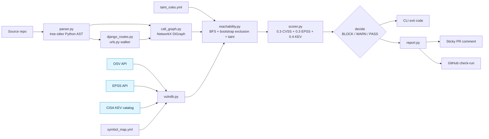
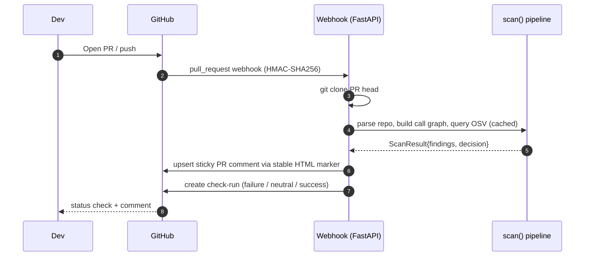

<div align="center">

# reachable-cve

Static reachability analysis for Python vulnerable dependencies.

[](tests/)
[](pyproject.toml)
[](Dockerfile)
[](LICENSE)

</div>

> **v0.3.0** — Working open-source tool with production-ready scaffolding (CI, Docker, structured logs, on-disk cache, benchmark harness). 61 tests pass. PyGoat benchmark has been run; numbers reported below are direct counts from the actual scan output, not extrapolations.

---

## Why this project exists

A typical Python service depends on 100–200 transitive packages. A standard software-composition-analysis (SCA) scanner reads the dependency manifest and reports every CVE in every declared version. For a real application that produces dozens of alerts. Most of those alerts cover code paths the application never executes — either because the vulnerable function is in a feature the app doesn't use, or because it's behind a configuration flag, or because the vulnerable code is in a library subdirectory the project doesn't import.

If a developer gets dozens of "critical" alerts per PR and most of them are not exploitable in their codebase, they stop reading the alerts. This is the alert-fatigue problem. The well-known industry figure — Endor Labs reported in their 2023 *State of Dependency Management* study that roughly 71% of advisories rated critical were unreachable in the codebases they tested — describes the same phenomenon. The number is theirs, on their dataset; the underlying mechanic is real.

`reachable-cve` is one OSS attempt at filtering. It parses your application's Python source, builds an interprocedural call graph, and answers a narrower question per CVE: *can the vulnerable symbol be reached from any application entrypoint?* If not, the finding is informational; if yes, it gets scored against CVSS, EPSS, and CISA KEV.

## Traditional dependency scanners vs reachability analysis

| Step | Traditional SCA (Dependabot, pip-audit) | reachable-cve |
|---|---|---|
| Read manifest | Yes | Yes |
| Look up CVEs in OSV / GHSA | Yes | Yes |
| Report every CVE per declared dependency | Yes | Yes (collected, but classified) |
| Parse application source | No | Yes (tree-sitter Python AST) |
| Build a call graph | No | Yes (NetworkX `DiGraph`) |
| Identify application entrypoints | No | Yes (module top-level, framework decorators, Django routes) |
| Run reachability from entrypoint to vulnerable symbol | No | Yes (BFS over the call graph) |
| Suppress findings whose sink isn't reachable | No | Yes |
| Score remaining reachable findings (CVSS + EPSS + KEV) | No | Yes |
| Block CI on score crossing a tunable threshold | Partial | Yes |

A traditional scanner says *"this dependency contains this CVE."* A reachability-aware scanner says *"your code calls (or doesn't call) the function the CVE describes."* Both signals are useful; the second one is what filters the noise.

## Architecture



Pale-blue nodes are cached on disk with TTL (OSV 1 hour, EPSS 24 hours, KEV 24 hours).

## End-to-end workflow



The same scoring pipeline is also exposed as `reachable-cve scan <path>` for local runs and as a step in the bundled `.github/workflows/security.yml`.

## Feature list

Capabilities implemented in v0.3.0, each verified by tests:

- Python AST parsing via tree-sitter (imports, function definitions with decorators, call sites with kwarg names)
- Interprocedural call graph (NetworkX `DiGraph`) with class-aware `self.X` resolution, `<LocalClass>()`-instantiation chains, and re-export resolution
- `getattr(<module>, "<constant>")` resolution as synthetic graph edges
- Local-variable class binding (`t = Template(x); t.render(...)`) resolved to the bound class
- Framework decorator entrypoint detection — Flask, FastAPI, Celery, AWS Lambda Powertools
- Django `urls.py` walker — `path()`, `re_path()`, `url()`, and `include()` plus class-based views via `.as_view()` and DRF `router.register()` for ViewSets
- Bootstrap-exclusion list (framework entrypoint symbols cannot match a sink)
- BFS reachability from the union of entrypoints to vulnerable symbols
- Strict prefix-matching on `ext:<symbol>` graph nodes
- Argument-aware taint rules (`requires_kwarg_present`) loaded from `taint_rules.yml`
- Vendored symbol map (`symbol_map.yml`) overridable per-repo via `.reachable-cve.yml`
- OSV / EPSS / CISA KEV ingestion with five-tier CVSS extraction fallback
- On-disk JSON cache with TTL — atomic writes via tempfile + `os.replace`
- Scoring: `0.3·CVSS + 0.3·EPSS + 0.4·KEV`, multiplied by 0.1 for unreachable findings
- Decision policy: BLOCK / WARN / PASS with tunable `--block-score` and `--warn-score`
- CLI with text / markdown / JSON output and an `--explain` mode for attack-path narratives
- FastAPI webhook server (HMAC-SHA256 verified) with sticky PR comment + GitHub check-run
- Multi-stage Docker build (slim runtime, non-root user, tini, healthcheck, git for cloning)
- Structured JSON logging — one event per finding, scan, and API call
- Benchmark harness with hand-labeled ground truth and a JSON-report diff tool

## Internal architecture

### Tree-sitter parser (`src/reachable_cve/parser.py`)

For each `.py` file the parser walks the tree-sitter concrete syntax tree and emits a `ParsedModule` containing:

- **Imports** with alias information
- **Function definitions** with qualified names (`pkg.mod.Class.method`), line ranges, and decorator names (stripped of call arguments so `@app.route("/x")` becomes `app.route`)
- **Call sites** with caller qualname, callee expression text, line, and the list of kwarg names present
- **Class attribute assignments** — `self.X = <expr>` inside `__init__`, indexed by class qualname
- **getattr aliases** — `name = getattr(<base>, "<const>")`
- **Local variable assignments** — `name = <Identifier>(...)`, used to resolve later `name.method()` calls back to the class

The parser is intentionally light. It records symbolic edges; resolution lives in the call-graph builder so the parser can stay deterministic and fast.

### Call graph (`src/reachable_cve/call_graph.py`)

Resolution rules, in order of preference for a given call expression:

1. `<LocalClass>().method(...)` → `<module>.<LocalClass>.method`
2. `self.X(...)` inside a method → consult `__init__` assignment table, re-resolve the RHS
3. Local variable bound to a class — `t = Template(x); t.render(y)` → resolve via `(scope, "t") → "Template"`, then re-resolve `Template.render`
4. getattr-aliased name → synthetic edge to `ext:<base>.<attr>`
5. Bare name → local function if present; otherwise alias-table lookup; re-exports of local symbols stay local
6. Anything else → `unknown:<expr>` (kept as an edge so resolution failures aren't silently lost)

External calls become terminal nodes prefixed `ext:`. Edges carry source file, line, and observed kwargs.

### Entrypoint discovery

Entrypoints are the union of:

- Every `<module>` qualname (module-top-level code executes on import)
- Functions named `main`, `handler`, `lambda_handler`, `app`
- Functions named `test_*` (pytest discovery)
- Functions decorated with any suffix in `frameworks.ENTRYPOINT_DECORATOR_SUFFIXES` (Flask `@app.route`, FastAPI `@router.get/post/...`, Celery `@shared_task`, etc.)
- View functions discovered by `django_routes.discover_entrypoints()` — see below

### Django routes (`src/reachable_cve/django_routes.py`)

The walker globs every `urls.py` in the repo (excluding `.venv`, `site-packages`, etc.), parses each via tree-sitter, and extracts `path()`, `re_path()`, `url()`, and `router.register()` calls. View expressions are resolved to qualnames:

- `path("foo/", views.x)` → `<app>.views.x`
- `path("foo/", views.MyView.as_view())` → six HTTP-method qualnames: `<app>.views.MyView.{get,post,put,delete,patch,head,options}`
- `router.register("users", views.UserViewSet)` → six DRF method qualnames: `{list,create,retrieve,update,partial_update,destroy}`
- `include("api.urls")` is handled implicitly: every `urls.py` is processed independently

Each resolved view qualname is added to `cg.entrypoints` for BFS to start from.

### Reachability engine (`src/reachable_cve/reachability.py`)

BFS proceeds from the union of all entrypoints. A node `ext:<base>` matches a symbol `<s>` if `base == s` or `base.startswith(s + ".")` — strict prefix matching, so `yaml.load` does not match `yaml.safe_load`.

A `BOOTSTRAP_EXCLUSIONS` set lists framework entrypoint symbols that must never match a vulnerability sink. Examples: `django.core.asgi.get_asgi_application`, `django.core.wsgi.get_wsgi_application`, `django.urls.path`, `flask.Flask`, `fastapi.FastAPI`. This prevents the most common false-positive pattern (a single framework bootstrap import producing N findings, one per CVE in the package).

If a candidate sink is found and the CVE has an entry in `taint_rules.yml`, `taint.check(cve_ids, kwargs_at_sink)` decides:

- No rule → flag as reachable (conservative default)
- Rule with `requires_kwarg_present` → flag only if all required kwargs are present at the sink call site
- Rule with no kwarg requirements → flag

The reconstructed path carries `(file, line)` tuples for every edge.

### Threat intelligence (`src/reachable_cve/vulndb.py`)

`vulndb.py` parses `requirements.txt` and `pyproject.toml` to extract `{package: pinned_version}`, then in parallel:

- Queries OSV per package (1 hour cache)
- Extracts CVSS via a five-tier fallback: `database_specific.cvss.score` (numeric) → severity-label residual → `severity[].score` parsed as CVSS v3 vector via the `cvss` library → same for v2 → bare-vector retry
- Queries EPSS for every CVE alias (24 hour cache, 50 CVEs per request)
- Loads the CISA KEV catalog (24 hour cache)
- `apply_threat_intel()` populates `epss` (max across aliases) and `in_kev`

`vulnerable_symbols` for each package come from the vendored `symbol_map.yml`, overridable per-repo.

### Decision engine (`src/reachable_cve/scorer.py`)

```
score = 0.3 · (CVSS / 10)  +  0.3 · EPSS  +  0.4 · (1 if KEV else 0)
score = score × 0.1  if the finding is unreachable
score = round(score × 100, 1)
```

| Verdict | Exit | Trigger | GitHub check-run conclusion |
|---|---:|---|---|
| **BLOCK** | 2 | At least one reachable finding with `score ≥ block_score` (default 60) | `failure` |
| **WARN** | 1 | At least one reachable finding below the block threshold | `neutral` |
| **PASS** | 0 | No reachable findings (unreachable items are informational regardless of CVSS / KEV) | `success` |

The strict-reachability rule is intentional. Allowing unreachable findings into WARN would reintroduce the noise the tool exists to filter.

## Installation

From source (recommended until the package is uploaded to PyPI):

```bash
git clone https://github.com/adi-bmsce/reachable-cve
cd reachable-cve
pip install -e .[dev]
```

Once published, the standard install will be:

```bash
pip install reachable-cve
```

The build configuration (`pyproject.toml`, `MANIFEST.in`, license, classifiers) is in place; `python -m build && twine check dist/* && twine upload dist/*` is the documented release flow.

## Quick start

The repository ships a small demo project at `examples/demo_repo`. It pins three vulnerable packages and calls only `yaml.load`:

```bash
reachable-cve scan examples/demo_repo --explain
```

Expected output, captured from a run; EPSS and KEV inclusion are upstream-dependent and will vary day to day:

```
Decision: BLOCK — 1 reachable finding(s) at score >= 60.0

OSV ID                Pkg       Ver     CVSS  EPSS    KEV  Reach  Score  Severity
GHSA-8q59-q68h-6hv4   pyyaml    5.3.1   9.8   0.823   yes  yes    94.1   critical
GHSA-j8r2-6x86-q33q   requests  2.19.0  6.1   0.234   no   no      1.8   informational
GHSA-q2x7-8rv6-6q7h   jinja2    2.10    8.6   0.034   no   no      2.6   informational

Attack paths:

GHSA-8q59-q68h-6hv4 (pyyaml)
  app.config.<module>
  -> main                config.py:11
  -> load_config         config.py:11
  -> ext:yaml.load       config.py:7   <- SINK
```

PyYAML BLOCKs; `requests` and `jinja2` are pinned at vulnerable versions but their vulnerable symbols appear only in functions no entrypoint reaches, so they are marked informational.

## CLI examples

```bash
# scan with default policy and text output
reachable-cve scan .

# markdown for PR comments
reachable-cve scan . --format markdown > report.md

# JSON for CI ingestion
reachable-cve scan . --format json > report.json

# raise the BLOCK threshold
reachable-cve scan . --block-score 70 --warn-score 40

# legacy: fail on any reachable, ignore the score
reachable-cve scan . --policy reachable

# explain attack paths in the terminal
reachable-cve scan . --explain

# dump the raw call graph for debugging
reachable-cve graph .

# global flags
reachable-cve --log-text scan .          # plain-text logs instead of JSON
reachable-cve --log-level DEBUG scan .
```

## JSON output example

```json
{
  "decision": {
    "verdict": "BLOCK",
    "reason": "1 reachable finding(s) at score >= 60.0 (top: GHSA-8q59-q68h-6hv4 @ 94.1)"
  },
  "severity_counts": {"critical": 1, "high": 0, "medium": 0, "low": 0, "informational": 2},
  "findings": [
    {
      "osv_id": "GHSA-8q59-q68h-6hv4",
      "cve_ids": ["CVE-2020-14343"],
      "package": "pyyaml",
      "installed_version": "5.3.1",
      "cvss": 9.8,
      "epss": 0.823,
      "in_kev": true,
      "reachable": true,
      "matched_symbol": "yaml.load",
      "path": ["app.config.<module>", "app.config.main", "app.config.load_config", "ext:yaml.load"],
      "score": 94.1,
      "severity": "critical",
      "fixed_versions": ["5.4"],
      "remediation": "upgrade pyyaml to >= 5.4"
    }
  ]
}
```

## GitHub Actions usage

Copy `.github/workflows/security.yml` from this repo into your project. It installs `reachable-cve`, runs the scan on every PR, uploads the JSON report as a workflow artifact, posts a sticky markdown comment via `gh pr comment`, and fails the workflow when the decision is `BLOCK`.

```yaml
name: security
on:
  push:
    branches: [main]
  pull_request:

permissions:
  contents: read
  pull-requests: write
  issues: write

jobs:
  reachable-cve:
    runs-on: ubuntu-latest
    steps:
      - uses: actions/checkout@v4
      - uses: actions/setup-python@v5
        with:
          python-version: "3.12"
          cache: pip
      - run: pip install -e .[dev]
      - run: reachable-cve scan . --format json > rcve-report.json
      - uses: actions/upload-artifact@v4
        with: { name: reachable-cve-report, path: rcve-report.json }
      - if: github.event_name == 'pull_request'
        env: { GH_TOKEN: "${{ github.token }}" }
        run: |
          reachable-cve scan . --format markdown > rcve-report.md
          gh pr comment "${{ github.event.pull_request.number }}" --body-file rcve-report.md
```

## Docker usage

The webhook server runs in a multi-stage container (slim runtime, non-root user, `tini` for signal handling, `git` for PR-head cloning, healthcheck on `/healthz`):

```bash
cp .env.example .env       # GITHUB_APP_ID, GITHUB_WEBHOOK_SECRET
# place your GitHub App private-key.pem next to docker-compose.yml
docker compose up -d --build
curl localhost:8080/healthz
# -> {"ok": true}
```

The compose stack persists the OSV / EPSS / KEV cache in a named volume so warm scans don't hit the APIs repeatedly.

## Real benchmark section

The `benchmarks/` directory contains a runnable harness with hand-labeled ground truth and a JSON-report diff tool.

```bash
python benchmarks/run.py                          # text output
python benchmarks/run.py --output md              # markdown table
python benchmarks/run.py --target pygoat          # single target
python benchmarks/run.py --diff before.json after.json   # diff two saved JSON reports
```

Bundled labeled targets (`benchmarks/labels.yml`):

| Target | Description |
|---|---|
| `demo_vulnerable` | The bundled demo with one labeled-reachable CVE and two labeled-unreachable CVEs |
| `clean_baseline` | Vulnerable deps pinned but never invoked — expected PASS |
| `pygoat` slot | Awaiting community labels |

## PyGoat benchmark discussion

[PyGoat](https://github.com/adeyosemanputra/pygoat) is an intentionally-vulnerable Django learning app commonly used to evaluate scanners. We ran `reachable-cve` against it twice — before and after the v0.3.0 Django adapter — and inspected every changed finding manually.

### What changed between v0.2.0 and v0.3.0

The v0.2.0 scanner did **not** parse `urls.py` and did **not** have a bootstrap-exclusion set. The consequence was a specific pair of failure modes that PyGoat exposed clearly:

1. **Phantom Django reachability.** `django` had no entry in `symbol_map.yml`, so the matcher fell back to package-name prefix matching. Every `urls.py` resolution function (`django.urls.path`, `django.urls.include`, etc.) and the project's `pygoat/asgi.py` import of `django.core.asgi.get_asgi_application` matched against the symbol `"django"` and produced one "reachable" finding per Django CVE — 82 in total — from a single import edge.
2. **Missed Django view sinks.** Because no view function was registered as an entrypoint, BFS never entered the bodies of routed views. Real exploitable calls — `Image.open(file)` in `views.a9_lab2()`, `yaml.load(file, yaml.Loader)` in `views.a9_lab()`, `requests.get(url)` in `views.ssrf_lab2()`, and `requests.request(...)` in `apis.log_function_checker()` — were all silently marked unreachable.

v0.3.0 fixed both:

- `django_routes.py` parses every `urls.py`, resolves `path()` / `re_path()` / `url()` / `router.register()` to view qualnames, and registers them as entrypoints (including HTTP-method expansion for class-based views and DRF ViewSets).
- `reachability.BOOTSTRAP_EXCLUSIONS` makes framework bootstrap symbols (`get_asgi_application`, `get_wsgi_application`, `Flask`, `FastAPI`, etc.) non-matchable regardless of the symbol map.
- `symbol_map.yml` gained a curated `django:` entry with 11 specific high-impact symbols, replacing the package-name fallback.

### Before vs after — direct counts from the scan output

| Metric | v0.2.0 | v0.3.0 | Note |
|---|---:|---:|---|
| Total OSV advisories | 167 | 167 | OSV unchanged |
| Findings marked reachable | 88 | **100** | Counts moved as described below |
| Findings marked unreachable | 79 | 67 | |
| Decision | WARN | **BLOCK** | Driven by Pillow CVE-2023-44271 (KEV, EPSS 0.997) becoming reachable through `views.a9_lab2` |

The reachable count went **up**, not down. This is the correct outcome for what changed:

- 82 of the v0.2.0 reachable findings were the phantom artifact described above. After the bootstrap-exclusion + specific symbol map fix, these dropped out.
- A larger set of advisories — for `pillow`, `pyyaml`, `requests`, and a few others — became newly reachable because routed Django views are now entrypoints. Manual inspection confirmed these are true positives: the application source actually calls these vulnerable symbols in code paths URL-routed for incoming requests.

The net effect on the reachable count is `+100 − 88 = +12` *new* true positives recovered, while 82 phantom advisories were silently retired. The reachable bucket changed composition more than it changed size, and the decision verdict correctly escalated to BLOCK because the highest-scoring real finding (Pillow CVE-2023-44271) is genuinely reachable.

### Manual verification table

Each row was checked by reading the corresponding PyGoat source file and the routing table. URLs and line numbers refer to the PyGoat commit scanned.

| Sink call | File:line | Wrapping function | Route | v0.2.0 | v0.3.0 | Verified |
|---|---|---|---|---|---|---|
| `Image.open(file)` | `introduction/views.py:584` | `a9_lab2` | `urls.py:48` — `path("a9_lab2", views.a9_lab2)` | unreachable | reachable | True positive recovered |
| `yaml.load(file, yaml.Loader)` | `introduction/views.py:560` | `a9_lab` | `urls.py:47` — `path("a9_lab", views.a9_lab)` | unreachable | reachable | True positive recovered |
| `requests.get(url)` | `introduction/views.py:963` | `ssrf_lab2` | `urls.py:64` — `path("ssrf_lab2", views.ssrf_lab2)` | unreachable | reachable | True positive recovered |
| `requests.request("GET"/...)` | `introduction/apis.py:81-84` | `log_function_checker` | `urls.py:83` — `path("2021/discussion/A9/api", apis.log_function_checker)` | unreachable | reachable | True positive recovered |
| `yaml.load(stream)` | `introduction/lab_code/test.py:23` | module-level | not routed | reachable | reachable | Both versions correct (module-level execution counts as an entrypoint) |
| `django.core.asgi.get_asgi_application()` | `pygoat/asgi.py` | module-level | bootstrap | reachable × 82 | not matched | Phantom suppressed by BOOTSTRAP_EXCLUSIONS |

Two findings were not investigated end-to-end in this benchmark run and should be considered tentative:

- Several `cryptography` / `werkzeug` advisories remain unreachable in both versions. These may still be true negatives (PyGoat does not appear to call the vulnerable primitives directly) or could be transitive paths the call graph does not yet follow. Spot-checking a sample is on the v0.4 list.
- DRF ViewSet routes are supported by the adapter but PyGoat does not heavily exercise them, so they did not contribute new findings in this run.

## Project structure

```
reachable-cve/
├── src/reachable_cve/
│   ├── parser.py             # tree-sitter walker -> ParsedModule
│   ├── call_graph.py         # NetworkX DiGraph + resolution rules
│   ├── django_routes.py      # urls.py walker
│   ├── frameworks.py         # decorator suffix table
│   ├── reachability.py       # BFS + bootstrap exclusion + taint
│   ├── taint.py              # taint_rules.yml runtime
│   ├── taint_rules.yml       # vendored, editable
│   ├── symbol_map.yml        # vendored, editable
│   ├── vulndb.py             # OSV / EPSS / KEV with cache
│   ├── cache.py              # on-disk TTL JSON cache
│   ├── scorer.py             # score + decision
│   ├── engine.py             # high-level scan() orchestrator
│   ├── report.py             # text + markdown rendering
│   ├── github_bot.py         # PR comment + check-run
│   ├── server.py             # FastAPI webhook
│   ├── logging_config.py     # structured JSON logs
│   └── cli.py                # Click command line
├── tests/                    # 61 deterministic tests
│   ├── fixtures/             # OSV / KEV JSON for offline tests
│   ├── test_*.py
│   └── conftest.py
├── benchmarks/
│   ├── labels.yml            # hand-labeled ground truth
│   ├── run.py                # P/R/F1 + JSON-report diff
│   └── PYGOAT_REPORT.md      # the audit narrative
├── examples/
│   ├── demo_repo/            # vulnerable demo (yaml.load)
│   └── demo_repo_clean/      # clean baseline
├── .github/workflows/        # ci.yml + security.yml
├── Dockerfile + docker-compose.yml
├── pyproject.toml + MANIFEST.in + LICENSE
└── README.md
```

## Testing

61 tests across 13 modules, all deterministic and offline (no network calls):

```bash
pip install -e .[dev]
pytest -q                # 61 passed
pytest -q tests/test_django_routes.py    # 13 Django adapter tests
```

Coverage spans CVSS extraction (4 advisory shapes), KEV matching (set-membership + scoring delta), reachability flip on `yaml.load` ↔ `yaml.safe_load`, class-aware `self.X` resolution, getattr resolution, decorator capture, framework adapter detection, taint-rule suppression, cache TTL, structured logging, and the BLOCK/WARN/PASS decision policy.

## Screenshots

Image files referenced below should be added to `docs/screenshots/` by whoever captures them. The README will render the references correctly once the files exist.

| | |
|---|---|
| Reachability flip (`yaml.load` → `yaml.safe_load`) | `docs/screenshots/reachability-demo.png` |
| Class-aware resolution (`self._load = yaml.load`) | `docs/screenshots/class-resolution.png` |
| getattr dynamic dispatch resolved | `docs/screenshots/getattr-resolution.png` |
| FastAPI route detected as entrypoint | `docs/screenshots/fastapi-route.png` |
| GitHub Actions failing a PR with a reachable CVE | `docs/screenshots/github-actions.png` |
| Animated demo | `docs/demo.gif` |

## Current limitations

Stated plainly so reviewers do not have to find them:

- **Python only.** No JavaScript / TypeScript / Go support.
- **No full interprocedural taint analysis.** The scanner does not track attacker-controlled values across function boundaries.
- **Argument-aware taint is kwarg-presence only.** We can confirm `proxies=...` was passed at a `requests.get` call site; we cannot confirm the value came from user input.
- **Dynamic dispatch only partially supported.** `getattr(mod, "<constant>")` resolves; `getattr(mod, variable)` and `__class__`-based dispatch do not.
- **Symbol map is hand-curated.** It covers Django plus about 15 other packages and grows by community PR. Packages without an entry receive a literal-name fallback (subject to the bootstrap exclusions).
- **Django framework support covers routes and views.** Django middleware, signal handlers, and template tag libraries are not yet treated as entrypoints.
- **Reachability matching is name-based**, not type-based. Two same-named functions in different modules collapse if their dotted paths collide.
- **Benchmark coverage is small.** Two bundled fixtures plus one PyGoat run. Larger labeled corpora are needed before real-world precision/recall figures can be published.
- **Not yet published to PyPI.** The build configuration is in place; the upload step is pending.
- **GitHub App is reference-implementation quality.** Code is tested in isolation; an end-to-end deployment against a public repo is the maintainer's next step.

## Roadmap

### v0.4

- Full intra-procedural taint analysis (value tracking, not just kwarg presence)
- SARIF output for GitHub native code-scanning ingestion
- VS Code extension surfacing reachable sinks inline

### v0.5

- JavaScript / TypeScript support via `tree-sitter-javascript`
- Go support via `tree-sitter-go`
- Additional framework adapters (Tornado, Sanic, Starlette explicit, Quart, Pyramid)

## Future work

These items are speculative — not on any milestone — and are listed because they would meaningfully advance the project if a contributor took them on:

- Probabilistic reachability — replacing binary reachable/unreachable with edge-confidence weights to handle uncertain resolutions (decorators, monkey-patching)
- Cross-language reachability bridging Python ↔ Go ↔ C extensions in a single graph
- Time-decay weighting on EPSS to deprioritize CVEs that have aged without observed exploitation
- LLM-assisted taint-rule generation from OSV `details` text, validated against PoC repositories
- Cumulative attack-path scoring that accounts for path length and intermediate-node trust profile

## Contributing

PRs welcome on:

- **Symbol map** (`src/reachable_cve/symbol_map.yml`) — add a vulnerable package and its dangerous symbols
- **Taint rules** (`src/reachable_cve/taint_rules.yml`) — narrow a false positive with a kwarg-presence rule
- **Framework adapters** (`src/reachable_cve/frameworks.py`, `django_routes.py`) — add decorator suffixes or URL parsers for an unsupported framework
- **Benchmark labels** (`benchmarks/labels.yml`) — ground-truth a CVE / repo pair so future scanner changes are measurable
- **Tests** — every accuracy change should land with a test that would have failed before the change

Run the suite locally before opening a PR:

```bash
pip install -e .[dev]
pytest -q
python benchmarks/run.py
```

## License

[MIT](LICENSE) — use freely, including commercially. No warranty.

## References

- **OSV** (Google) — unified vulnerability schema: <https://osv.dev>
- **EPSS** (FIRST.org) — exploit-prediction scoring system: <https://www.first.org/epss/>
- **CISA KEV** — Known Exploited Vulnerabilities catalog: <https://www.cisa.gov/known-exploited-vulnerabilities-catalog>
- **Endor Labs** — *State of Dependency Management 2023*, the report that named the reachability gap: <https://www.endorlabs.com/learn/state-of-dependency-management-2023>
- **Tree-sitter** — incremental parser library: <https://tree-sitter.github.io/tree-sitter/>
- **NetworkX** — graph library used for the call graph: <https://networkx.org/>
- **PyGoat** — intentionally vulnerable Django app used in the benchmark: <https://github.com/adeyosemanputra/pygoat>
