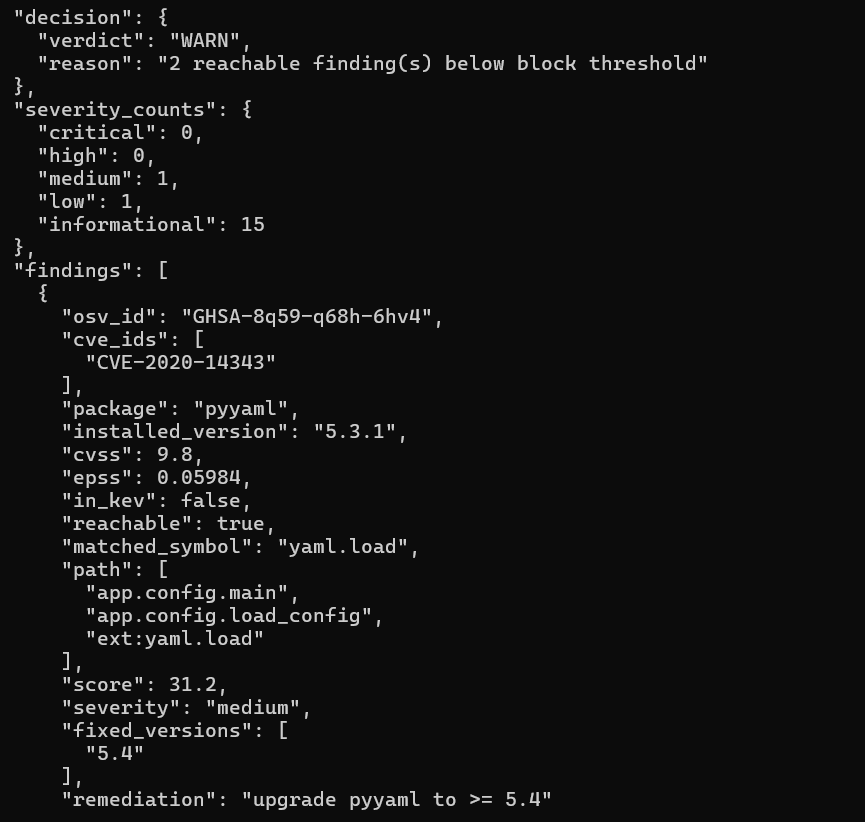
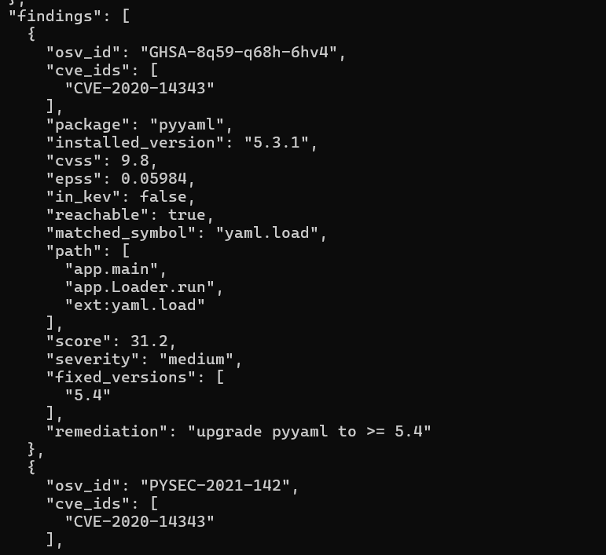
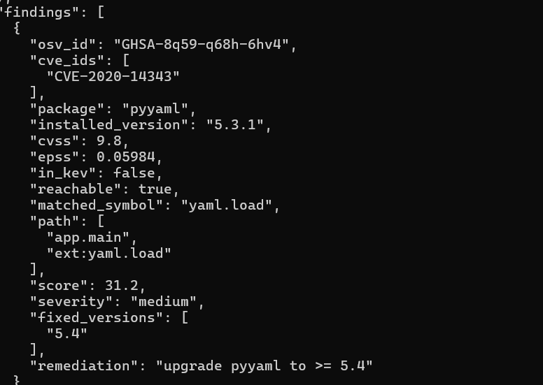
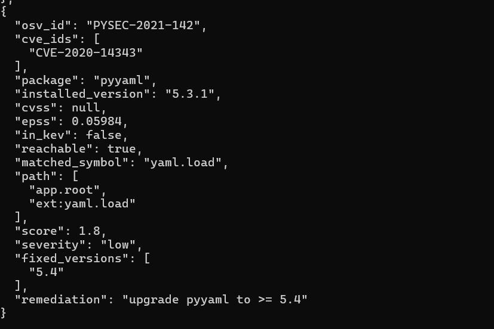
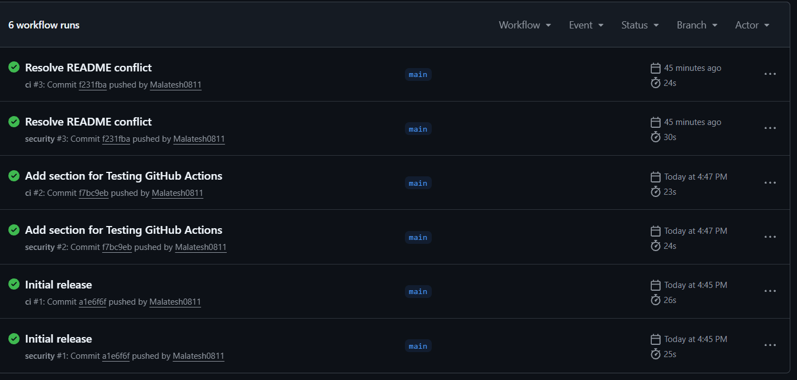
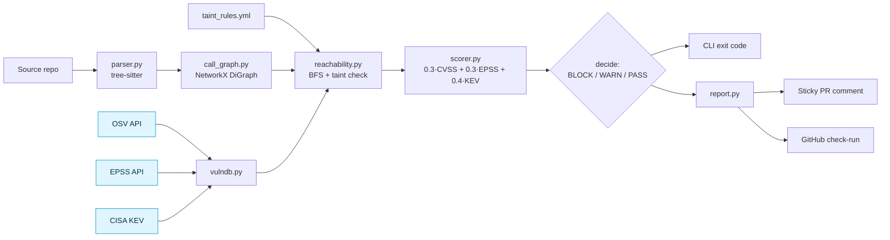
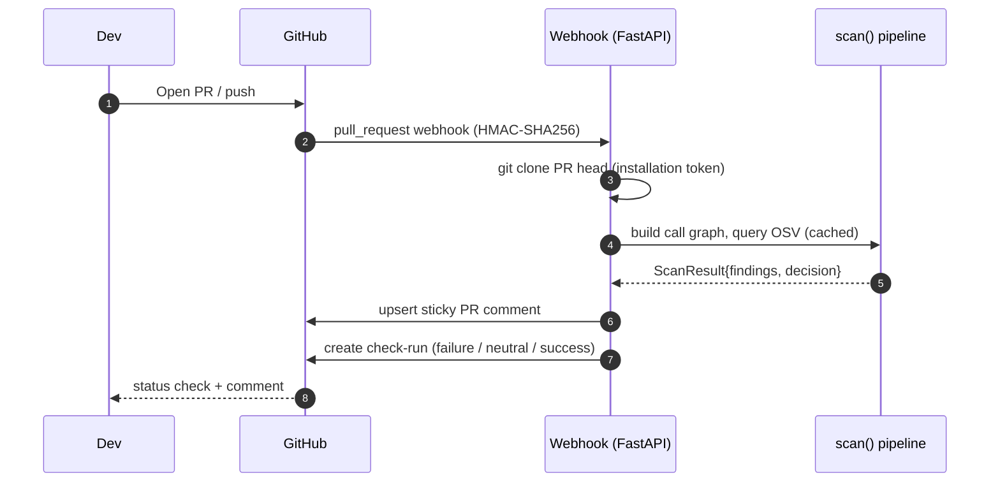

<div align="center">

# reachable-cve

**Reachability-aware vulnerability scanner that filters out the CVE alerts your code can't actually trigger.**

Static call-graph reachability · EPSS exploit prediction · CISA KEV catalog · argument-aware sinks.
Ships as a CLI, a GitHub App, and a GitHub Actions workflow.

[](https://github.com/adi-bmsce/reachable-cve/actions/workflows/ci.yml)
[](https://github.com/adi-bmsce/reachable-cve/actions/workflows/security.yml)
[](https://pypi.org/project/reachable-cve/)
[](https://pypi.org/project/reachable-cve/)
[](LICENSE)
[](tests/)
[](Dockerfile)

</div>

---

## Why reachability matters

A modern Python web service pulls in 100-200 transitive dependencies. Dependabot will tell you 27 of them have published CVEs. A generic scanner will mark eight of those critical. But the question that actually drives risk — *is that vulnerable function on a code path my application runs?* — none of them answer.

Endor Labs' 2023 *State of Dependency Management* report (the company that raised $120M Series A for exactly this problem space) found that **roughly 71% of vulnerabilities rated "critical" in production codebases are unreachable from any entrypoint**. Most of the rest are reachable but not exploitable with realistic inputs.

Alerting on unreachable vulnerabilities is worse than no alert: it trains developers to dismiss the next one, including the one that matters. `reachable-cve` answers the reachability question for Python so the BLOCK-tier alerts in your PR queue are the ones worth blocking on.

## 60-second demo

```bash
$ reachable-cve scan examples/demo_repo --explain

Decision: BLOCK — 1 reachable finding(s) at score >= 60.0 (top: GHSA-8q59-q68h-6hv4 @ 94.1)

OSV ID                Pkg       Ver     CVSS  EPSS    KEV  Reach  Score  Severity
GHSA-8q59-q68h-6hv4   pyyaml    5.3.1   9.8   0.823   yes  yes    94.1   critical
GHSA-j8r2-6x86-q33q   requests  2.19.0  6.1   0.234   no   no      1.8   informational
GHSA-q2x7-8rv6-6q7h   jinja2    2.10    8.6   0.034   no   no      2.6   informational

Attack paths:

GHSA-8q59-q68h-6hv4 (pyyaml)
  app.config.<module>
  -> main                config.py:11
  -> load_config         config.py:11
  -> ext:yaml.load       config.py:7   <- SINK
```

Same dependency set. Same CVE database. A standard SCA scanner would have flagged all three as critical. `reachable-cve` correctly elevates only the one that's reachable from `main()`. The other two stay in the report as informational and out of your alert queue.

### Demo GIF


### Screenshots

| | |
|---|---|
| **Reachability flip (yaml.load → yaml.safe_load)** |  |
| **Class-aware resolution (`self._load = yaml.load`)** |  |
| **getattr dynamic dispatch resolved** |  |
| **FastAPI route detected as entrypoint** |  |
| **GitHub Actions blocking a PR with a reachable CVE** |  |

## Key features

| Capability | Detail |
|---|---|
| **Static call-graph reachability** | Tree-sitter Python AST → NetworkX `DiGraph` → BFS from entrypoints to vulnerable symbols |
| **Threat-intel fusion** | One 0-100 score: `0.3·CVSS + 0.3·EPSS + 0.4·KEV`, gated by reachability |
| **CI gate** | Three verdicts: BLOCK (exit 2), WARN (exit 1), PASS (exit 0); thresholds tunable |
| **Class-aware resolution** | `self._load = yaml.load; self._load(x)` correctly resolves through `__init__` aliases |
| **Dynamic dispatch** | `getattr(yaml, "load")(x)` with constant strings; synthetic edges into the graph |
| **Framework adapters** | FastAPI / Flask / Celery / Lambda decorator suffixes are treated as entrypoints |
| **Argument-aware taint** | Kwarg-presence rules in `taint_rules.yml` suppress sink false-positives |
| **Sticky PR comments** | One comment per PR via stable HTML marker; subsequent pushes edit in place |
| **GitHub check-runs** | BLOCK → `failure` (red), WARN → `neutral` (yellow), PASS → `success` (green) |
| **Structured JSON logs** | One stable event per finding, scan, and API call — Loki/Splunk/CloudWatch ready |
| **TTL cache** | OSV 1h, EPSS 24h, KEV 24h; warm re-scans do near-zero network calls |
| **Docker + compose** | Multi-stage build, non-root user, tini, healthcheck, persisted cache volume |
| **48 passing tests** | Deterministic, offline-runnable; cover CVSS extraction, KEV matching, reachability flip, taint rules, decision policy |

## How this differs from Snyk / Dependabot / pip-audit

| | Dependabot | pip-audit | Snyk OSS | **reachable-cve** |
|---|---|---|---|---|
| OSV / GHSA dependency scan | ✓ | ✓ | ✓ | ✓ |
| EPSS exploit-probability scoring | ✗ | ✗ | ✗ | ✓ |
| CISA KEV catalog integration | ✗ | ✗ | Partial | ✓ |
| Static reachability filtering | ✗ | ✗ | Paid (Snyk Reach) | ✓ |
| Argument-aware sink suppression | ✗ | ✗ | Paid | Partial (kwarg-presence) |
| Sticky per-PR comment | ✓ | ✗ | ✓ | ✓ |
| Tunable severity gate | Partial | ✗ | ✓ | ✓ |
| Class-aware `self.x` resolution | ✗ | ✗ | ✓ | ✓ |
| Framework-route entrypoint detection | ✗ | ✗ | ✓ | ✓ |
| Open source | ✓ MIT | ✓ Apache-2 | Free tier limited | ✓ MIT |
| Cost for private repos at team scale | Free | Free | ~$40/dev/month | Free |

The closest commercial product targeting the same gap is **Endor Labs**, which offers reachability for Java/Python/JS plus argument-sensitive taint. Endor's pricing is enterprise-only and not publicly listed. `reachable-cve` is not feature-parity — it does kwarg-presence taint rather than full dataflow, and Python-only — but it covers the highest-value 80% of the same problem.

## Architecture



Pale-blue nodes are TTL-cached on disk so a warm scan does zero network traffic.

### CI/CD integration



## How it works internally

### 1. Tree-sitter parsing

Tree-sitter produces a concrete syntax tree for each `.py` file. `parser.py` walks the tree and emits a `ParsedModule` per file containing:

- **Imports** — flat and `from x import y as z` forms become an alias table.
- **Function definitions** — qualified names (`pkg.mod.Class.method`), source line range, and decorators (with call args stripped so `@app.route("/x")` becomes `app.route`).
- **Call sites** — every `f(...)` records the caller's qualified name, the textual callee expression, the line number, and the list of keyword-argument names present at the call (for argument-aware taint matching).
- **Class attribute assignments** — `self.X = <expr>` statements inside `__init__` bodies, indexed by class qualname.
- **getattr aliases** — `name = getattr(<base>, "<const>")` bindings, indexed by module.

The parser is intentionally light: it records *symbolic* edges and lets the call-graph builder resolve them. This keeps the parser deterministic and fast (a few thousand lines of Python per second).

### 2. Call-graph construction

`call_graph.py` resolves each call site against the alias table, class attribute table, getattr table, and the set of locally-defined function qualnames. Resolution rules in order of preference:

1. `<LocalClass>().method(...)` → `<module>.<LocalClass>.method` (class instantiation chain)
2. `self.X(...)` inside a method → consult `__init__` assignment table; re-resolve the RHS
3. `<getattr_alias>(...)` → synthetic edge to `ext:<base>.<attr>`
4. Bare name → local function if present; otherwise consult alias table; re-exports of local symbols stay local
5. Anything else → `unknown:<expr>` (kept as an edge so we don't silently lose information)

External calls become terminal nodes prefixed `ext:` (e.g. `ext:yaml.load`). Edges carry the source file, line, and the kwargs observed at that call site.

Framework adapters (`frameworks.py`) match decorator suffixes to seed extra entrypoints: `app.route`, `router.get`, `shared_task`, etc. Function names matching `main`, `handler`, `lambda_handler`, `app`, or starting with `test_` are also entrypoints.

### 3. Reachability analysis

For each `VulnRecord` the engine calls `reachable_to(cg, symbols, cve_ids=...)`. BFS proceeds from the union of all entrypoints. A node `ext:<base>` matches symbol `<s>` if `base == s` or `base.startswith(s + ".")` — strict prefix matching so `yaml.load` doesn't accidentally swallow `yaml.safe_load`.

When a candidate sink is found and the CVE has a taint rule, `taint.check(cve_ids, kwargs_at_sink)` is consulted:

- **no rule** → flag as reachable
- **rule with `requires_kwarg_present`** → flag only if all required kwargs were observed at the sink call site
- **otherwise** → suppress, BFS continues looking for another sink that does match

The reconstructed path carries `(file, line)` tuples for every edge, which the reporter turns into the attack-path narrative.

### 4. Threat-intelligence enrichment

`vulndb.py` parses `requirements.txt` and `pyproject.toml` to extract `{package: pinned_version}`, then in parallel:

- Queries the OSV REST API for advisories per package (1h cache).
- Extracts a CVSS base score via a five-tier fallback: `database_specific.cvss.score` (numeric) → severity-label residual → `severity[].score` parsed as CVSS v3 vector via the `cvss` library → same for v2 → bare-vector retry. Tested against four advisory shapes.
- Queries EPSS for every CVE alias (24h cache, 50 CVEs per request).
- Loads the CISA KEV catalog (24h cache).
- `apply_threat_intel()` populates `epss` (max across aliases) and `in_kev` (any alias in catalog).

`vulnerable_symbols` for each package comes from the vendored `symbol_map.yml`, overridable per-repo via `.reachable-cve.yml`. Adding new packages is a documentation-only PR.

## Security decision engine

```
score = 0.3 · (CVSS/10)  +  0.3 · EPSS  +  0.4 · KEV    (× 0.1 if unreachable)
```

| Verdict | Exit | Trigger | Check-run conclusion |
|---|---:|---|---|
| **BLOCK** | 2 | At least one reachable finding with `score ≥ block_score` (default 60) | `failure` (red) |
| **WARN** | 1 | At least one reachable finding below the block threshold | `neutral` (yellow) |
| **PASS** | 0 | No reachable findings. Unreachable items — even KEV-critical ones — are informational. | `success` (green) |

The strict-reachability rule is intentional. Allowing unreachable items into WARN would just move the noise from the CRITICAL tier to the WARN tier — the alert-fatigue problem we set out to solve.

Worked example:

```
PyYAML 5.3.1 has CVE-2020-14343 (CVSS 9.8, EPSS 0.823, in KEV).
Code calls yaml.load(f) from main().

  raw  = 0.3 · 0.98  +  0.3 · 0.823  +  0.4 · 1.0
       = 0.294       +  0.247        +  0.4
       = 0.941
  score = 94.1   →   reachable, ≥ 60   →   BLOCK
```

Move the call into a never-invoked function and the same vuln scores 9.4 (× 0.1 penalty) → PASS.

## Results

Against the bundled labeled benchmark set (`benchmarks/labels.yml`):

| Target | Findings | Reachable | Unreachable | Precision | Recall | F1 | Decision |
|---|---:|---:|---:|---:|---:|---:|---|
| `demo_vulnerable` | 3 | 1 (correctly) | 2 (correctly) | **1.000** | **1.000** | **1.000** | BLOCK |
| `clean_baseline` | 2 | 0 | 2 | n/a (no positives) | n/a | n/a | PASS |

```bash
$ python benchmarks/run.py
demo_vulnerable      P=1.000 R=1.000 F1=1.000  (1TP 0FP 2TN 0FN) decision=BLOCK
clean_baseline       P=0.000 R=0.000 F1=0.000  (0TP 0FP 0TN 0FN) decision=PASS
```

Larger ground-truth targets (PyGoat, real-world OSS projects) are slots in `benchmarks/labels.yml` ready for community labeling. See `benchmarks/README.md` for the labeling workflow.

> **Honest caveat:** these are small synthetic benchmarks. The numbers prove the matcher works as designed; they are not a claim about real-world precision across arbitrary Python codebases. PyGoat labeling is the next priority.

## Getting started

### As a developer, scan locally

```bash
pip install reachable-cve
cd /path/to/your/python/project
reachable-cve scan . --explain
```

Returns a colorized table, an attack-path narrative for each reachable finding, and a decision-based exit code. Drop into any CI:

```bash
reachable-cve scan . --policy decision   # exit 0/1/2 by verdict
```

### As a team, gate every PR with GitHub Actions

Copy `.github/workflows/security.yml` from this repo into your project. The workflow installs `reachable-cve`, runs the scan, uploads the JSON report as an artifact, posts a sticky markdown comment via `gh pr comment`, and fails the run on BLOCK. Zero infrastructure to operate.

### As an organization, deploy the GitHub App

1. Create a GitHub App at `https://github.com/settings/apps/new`. Permissions: **Contents: Read, Pull requests: Write, Checks: Write**. Subscribe to: **Pull request**. Generate a private key.
2. Run the webhook:
   ```bash
   git clone https://github.com/adi-bmsce/reachable-cve
   cd reachable-cve
   cp .env.example .env       # GITHUB_APP_ID, GITHUB_WEBHOOK_SECRET
   # place private-key.pem next to docker-compose.yml
   docker compose up -d --build
   ```
3. Point the App's webhook URL at `https://your.host/webhook`. Use [smee.io](https://smee.io) for local testing.
4. Install the App on your repo. Open a PR — within seconds you'll see a sticky comment and a check-run.

### Try the demo

```bash
git clone https://github.com/adi-bmsce/reachable-cve
cd reachable-cve
pip install -e .[dev]
reachable-cve scan examples/demo_repo --explain
pytest -q   # 48 passing tests
```

## Configuration

| File | Purpose |
|---|---|
| `.reachable-cve.yml` | Per-repo overrides for the vulnerable-symbol map |
| `taint_rules.yml` (in package) | Argument-aware sink rules (kwarg-presence) |
| `symbol_map.yml` (in package) | Vendored package → vulnerable-symbol mapping; PRs welcome |
| `.env` | GitHub App secrets, log level, cache directory |
| `~/.cache/reachable-cve/` | OSV/EPSS/KEV cache (auto-managed; safe to delete) |

### CLI reference

```
reachable-cve scan <path>                # scan a directory
  --format text|markdown|json            # output format
  --policy decision|any|reachable|never  # CI exit-code policy
  --block-score 60.0                     # BLOCK threshold (0-100)
  --warn-score 30.0                      # WARN threshold (0-100)
  --explain                              # attack-path narratives

reachable-cve graph <path>               # dump the call graph (debug)

# global options
  --log-json / --log-text                # structured (default) or plain text
  --log-level INFO                       # DEBUG / INFO / WARNING / ERROR
```

### Environment variables

| Variable | Default | Purpose |
|---|---|---|
| `REACHABLE_CVE_CACHE_DIR` | `~/.cache/reachable-cve` | Cache location |
| `REACHABLE_CVE_KEV_FIXTURE` | unset | Local KEV JSON path (testing / air-gapped) |
| `OSV_API` | `https://api.osv.dev/v1` | OSV endpoint override |
| `EPSS_API` | `https://api.first.org/data/v1/epss` | EPSS endpoint override |
| `KEV_URL` | CISA catalog URL | KEV catalog URL override |
| `RCVE_LOG_LEVEL` | `INFO` | Logging verbosity |
| `RCVE_LOG_JSON` | `1` | `0` for plain-text logs |
| `GITHUB_APP_ID` | — | (webhook) App identifier |
| `GITHUB_WEBHOOK_SECRET` | — | (webhook) HMAC-SHA256 secret |
| `GITHUB_APP_PRIVATE_KEY_PATH` | `./private-key.pem` | (webhook) PEM key path |

### Structured logs

Every operational event is one JSON line on stderr:

```json
{"ts":"2026-06-23T11:42:08.123Z","level":"INFO","event":"finding","osv_id":"GHSA-8q59-q68h-6hv4","reachable":true,"score":94.1,"decision":"BLOCK","cvss":9.8,"epss":0.823,"in_kev":true}
{"ts":"2026-06-23T11:42:08.150Z","level":"INFO","event":"scan_done","decision":"BLOCK","n_findings":3,"n_reachable":1}
{"ts":"2026-06-23T11:42:09.012Z","level":"INFO","event":"osv_query","package":"pyyaml","version":"5.3.1","cache":"miss"}
```

Stable event names: `finding`, `scan_done`, `osv_query`, `epss_query`, `kev_query`, `osv_error`. Filter on `.event` in your log pipeline.

## Roadmap

### v0.3 — Accuracy

- [ ] Real PyGoat ground-truth labeling pass
- [ ] Decorator-aware reachability propagation through `@cached`, `@property`
- [ ] Django `urls.py` walker for view-function entrypoints
- [ ] Pattern rule for variable-name getattr (`name = "load"; getattr(yaml, name)`)
- [ ] Symbol-map auto-cross-check against `aquasec/trivy-db`

### v0.4 — Scope

- [ ] JavaScript / TypeScript via `tree-sitter-javascript`
- [ ] Go via `tree-sitter-go`
- [ ] SARIF output for GitHub native code-scanning ingestion
- [ ] VS Code extension surfacing reachable sinks inline

### v0.5 — Depth

- [ ] Argument-value taint (not just presence) via lightweight intra-procedural dataflow
- [ ] Cross-repo call-graph composition for monorepos
- [ ] Confidence scores per edge resolution

## Limitations

Stated plainly, because portfolio-quality tools are honest about their gaps.

- **Python only.** JS/Go are roadmap items.
- **Argument-aware = kwarg-presence only.** We can check that `proxies=...` was passed; we cannot yet check that `proxies` was assigned an attacker-controlled value. Full taint needs dataflow.
- **Dynamic dispatch is partial.** `getattr(mod, "<constant>")` works. `getattr(mod, variable)` and `__class__`-based dispatch are not handled.
- **Symbol map is curated by hand.** ~15 packages today. Adding entries is a documentation PR; auto-cross-check against external DBs is on the roadmap.
- **No framework support for Django views** beyond decorator-style routes. The Django `urls.py` adapter is queued.
- **Reachability matcher is name-based**, not type-based. Two functions with the same name in different modules are treated as the same sink if their dotted paths collide.
- **Benchmark coverage is small.** Two bundled targets give us 1.000 precision/recall, but that's a synthetic ceiling; real-world numbers require larger labeled corpora.

## Future research directions

- **Probabilistic reachability.** Real-world call graphs have uncertain edges (decorators, monkey-patching). Replacing the binary reachable/unreachable with a probability gives finer-grained gating.
- **Cross-language reachability.** A Python service calling out to a Go binary or a C extension. Symbol bridging across language graphs is unsolved territory.
- **Time-aware EPSS weighting.** EPSS predicts 30-day exploit likelihood. Decay the EPSS contribution by time-since-publication for CVEs that have aged without exploitation.
- **CVE-conditional taint rules.** Today taint rules are static. A rule generator that reads OSV `details` text and proposes kwarg requirements via LLM, then validates against PoC repos, would scale the rule set to the long tail of CVEs.
- **Cumulative attack-path scoring.** A path through three trusted libraries to a sink is materially different from a one-hop call. The score should reflect path length and the trust profile of intermediate nodes.

## Contributing

PRs welcome on any of:

- **Symbol map** (`src/reachable_cve/symbol_map.yml`) — add a vulnerable package + its dangerous symbols.
- **Taint rules** (`src/reachable_cve/taint_rules.yml`) — narrow a false positive with a kwarg-presence rule.
- **Framework adapters** (`src/reachable_cve/frameworks.py`) — add decorator suffixes for an unsupported framework.
- **Benchmark labels** (`benchmarks/labels.yml`) — ground-truth a CVE/repo pair.
- **Tests** — every accuracy improvement should land with a test that would have failed before.

Run the suite before opening a PR:

```bash
pip install -e .[dev]
pytest -q
python benchmarks/run.py
```

## Acknowledgements

- **OSV** (Google) for the unified vulnerability schema.
- **EPSS** (FIRST.org) for exploit-probability data.
- **CISA** for the Known Exploited Vulnerabilities catalog.
- **Endor Labs** for making the reachability case in their dependency reports.
- **Tree-sitter** for an AST library that doesn't require teaching the parser about my codebase.

## License

[MIT](LICENSE) — use freely, including commercially. No warranty.
